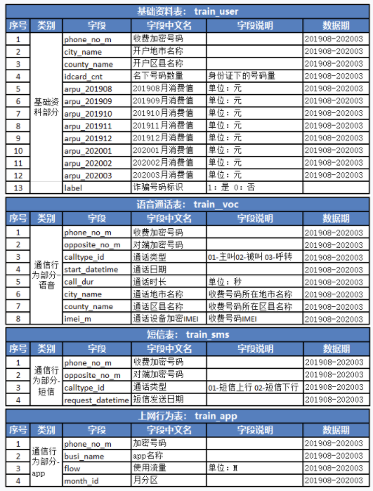

# 比赛地址

2020首届数字四川创新大赛算法对抗赛：诈骗电话识别大赛

```
http://www.scdata.net.cn/common/cmpt/%E8%AF%88%E9%AA%97%E7%94%B5%E8%AF%9D%E8%AF%86%E5%88%AB_%E6%8E%92%E8%A1%8C%E6%A6%9C.html
```

# 竞赛背景

近年来，通过拨打电话、群发短信实施诈骗的违法行为一直困扰着手机用户，给移动手机用户造成了困扰甚至金钱的损失，如何有效防护诈骗电话对用户隐私、财产造成的威胁，成为公安急需解决的问题，也是四川移动提升用户满意度、保护用户权益需要高度关注的问题。

通过诈骗电话号码的通信行为，识别诈骗电话，及时关停诈骗号码，成为运营商与公安部门合作的持续的工作，虽取得一定成绩，但诈骗方式的不断翻新，给诈骗电话的准确识别带来了持续算法挑战。

# 比赛任务

基于用户通信行为数据的诈骗电话识别，将针对诈骗电话与正常用户在语音、短信、上网行为数据的差异，构建诈骗电话识别算法，快速准确识别出诈骗电话，供公安部门与运营商及时关停诈骗号源，打击诈骗犯罪行为。选手需自行分析脱敏样本数据，找出规律，构建识别算法。

# 数据介绍

比赛提供了四个表：



数据按时间划分为训练集和测试集。

- 初赛阶段：预测2020年4月的数据；
- 复赛阶段：预测2020年5月的数据；
- 决赛阶段：预测2020年6月的数据。

简单地说，用初赛里举例，训练集中提供了 201908、201909、... 、202003 八个月的数据，但是测试集中只有 202004 这一个月的数据；复赛决赛与之类似。

# 构建 Baseline

因为 train 和 test 并没有交叉，所以最朴素的想法是只取训练集中最后一个月的数据来作为新的训练集，当然这只是 baseline，应该还有更好的做法。

特征工程部分：

1. user 表：只对 `city_name` 和 `county_name` 做了标签化处理；
2. voc 表：切割时间，当一天和一小时分别做统计特征；
3. sms 表：切割时间，当一天和一小时分别做统计特征；
4. app 表：流量统计特征。

以上都是简单的 baseline 套路。其他上分特征等待和大家一起探索。

模型方面采用 LGB 五折，最终线下 f1 得分为 0.87，线上 f1 分数为 0.85 左右。

详细的代码见 github 链接。

# TODO

1. 更有效地利用训练集里八个月的数据；
2. voc、sms 除了统计特征，还可以做时间间隔特征等；
3. app 可以重点关注一些应用的流量，甚至可以像今年腾讯赛一样做 w2v；
4. city、county 可以做其他的编码方式；
5. 其他常规的融合和 stacking。